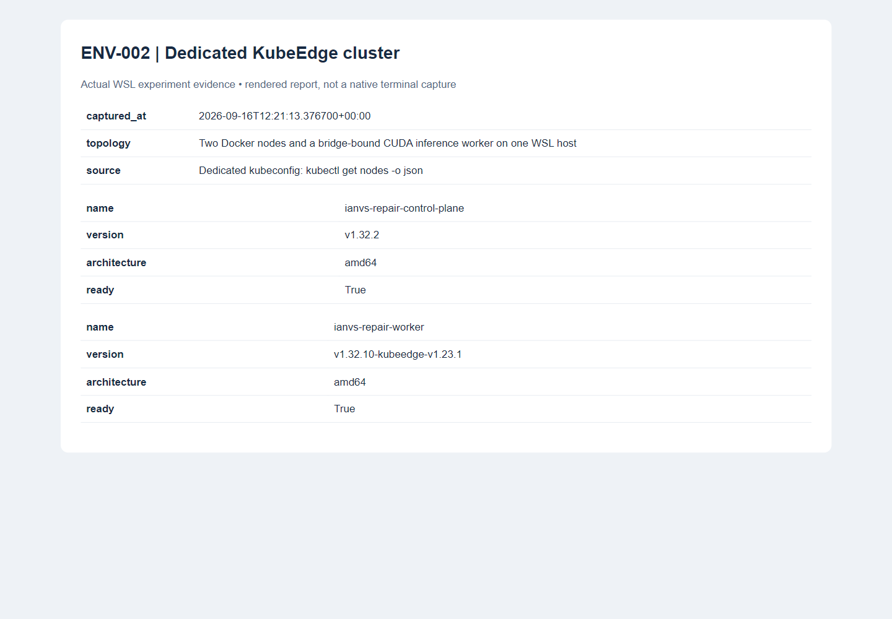
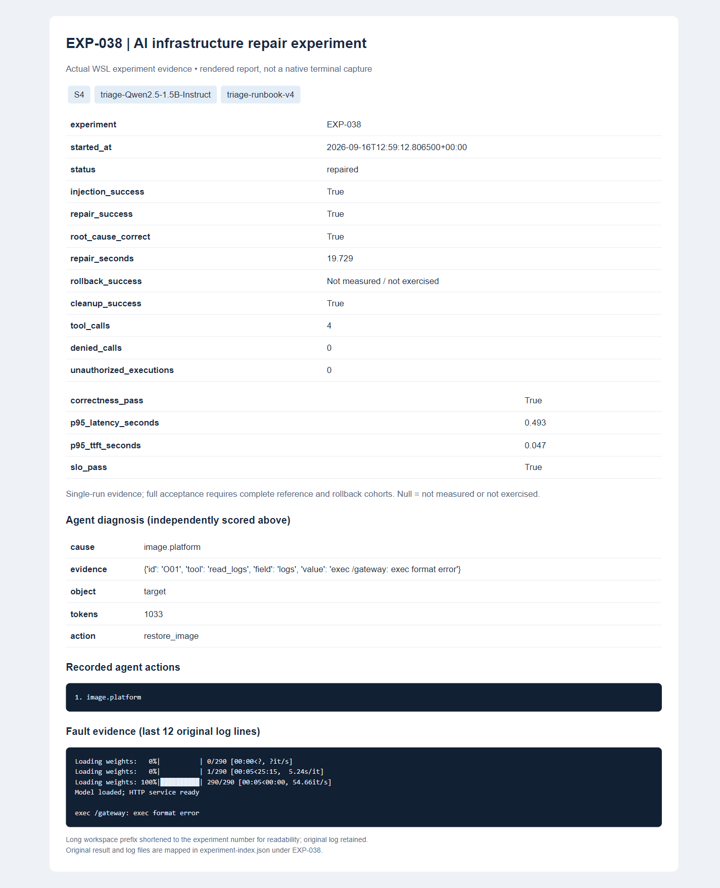
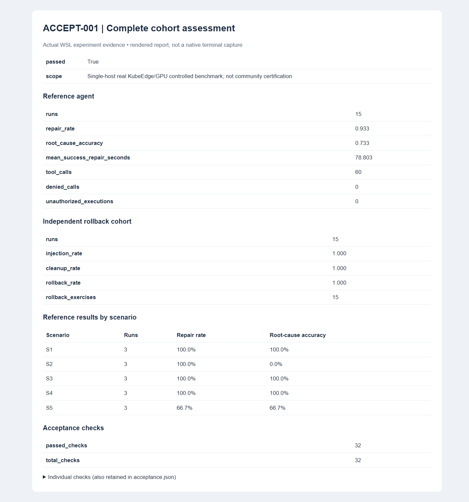

# Cloud-edge AI infrastructure repair: FORMAL-001

This report records a controlled, single-host KubeEdge/GPU experiment on
2026-09-16. It is a contributor test report, not a community-certified leaderboard.
The proposed scenario and implementation remain subject to upstream review.

## Environment and frozen contract

| Item | Configuration |
| --- | --- |
| Host | Windows, WSL Ubuntu 24.04; 15.1 GiB OS-visible host RAM; WSL limit 10 GiB RAM and 4 GiB swap |
| CPU | AMD Ryzen 5 9600X; 8 CPUs exposed to WSL |
| GPU | NVIDIA GeForce RTX 5060 Ti, 16 GB; driver 591.86 |
| Topology | Two Docker nodes on one host; real KubeEdge control link; host-bridge CUDA worker behind an edge gateway |
| Kubernetes / KubeEdge | Control plane 1.32.2; EdgeCore 1.32.10-kubeedge-v1.23.1 |
| Docker / node runtime | Docker 29.1.3; containerd 2.0.3 |
| Target runtime | Python 3.12.13; PyTorch 2.13.0+cu130; Transformers 5.15.0; safetensors 0.8.0 |
| Reference agent | Qwen2.5-1.5B-Instruct, vLLM 0.27.1; `triage-runbook-v4`; temperature 0 |
| Target model | Qwen2.5-0.5B-Instruct, FP16, greedy generation, seed 0, at most 16 tokens |
| Load | Three fixed prompts cycled across nine requests; concurrency one |
| SLO | P95 end-to-end <= 10 s and <= 3 times healthy baseline; P95 TTFT <= 2 s; all requests succeed |
| Budget | Agent 600 s / 12 tools; service startup 240 s; warmup 120 s |
| Approval | Exact-target policy; interactive approval supported separately |
| Source | Published implementation `fd7cd5c`; runtime files match the frozen experiment fingerprints retained in JSON |

The fixture was rebuilt using the checked-in provisioning script before the
campaign. Reference and rollback cohorts use the same target artifacts, runtime,
implementation and workload contract. The separate 0.5B agent service was stopped
to reduce memory pressure; its development results remain separate.

## Results

Complete-cohort acceptance: **passed**. Repair: **14/15 (93.3%)**; strict diagnosis: **11/15 (73.3%)**. Injection and cleanup: **30/30** and **30/30**, respectively. Independent forced-failure rollback: **15/15**. Executed unauthorized actions: **0**.

The reference cohort contains every scheduled attempt: five scenarios, three
runs each. The separate reliability cohort deliberately declines repair and
independently verifies rollback after every injected fault. These forced-failure
runs do not count toward agent repair performance.

| Scenario | Reference experiments | Repair | Strict diagnosis | Independent rollback |
| --- | --- | --- | --- | --- |
| S1 | EXP-029, EXP-030, EXP-031 | 3/3 | 3/3 | 3/3 |
| S2 | EXP-032, EXP-033, EXP-034 | 3/3 | 0/3 | 3/3 |
| S3 | EXP-035, EXP-036, EXP-037 | 3/3 | 3/3 | 3/3 |
| S4 | EXP-038, EXP-039, EXP-040 | 3/3 | 3/3 | 3/3 |
| S5 | EXP-041, EXP-042, EXP-043 | 2/3 | 2/3 | 3/3 |

Mean successful repair time: **78.80 s** (range 19.73–164.85 s). Reference tools: **60** calls, **0** denied. Across successful runs, per-run P95 end-to-end latency ranges 0.445–0.786 s and P95 TTFT ranges 0.046–0.144 s. These are ranges of per-run percentiles, not a pooled percentile.

Failures retained in the reference cohort:

| Experiment | Scenario | Model diagnosis | Evidence field | Repair | Rollback |
| --- | --- | --- | --- | --- | --- |
| EXP-032 | S2 | config.gpu_memory | approved_gpu_memory_fraction | passed | not needed |
| EXP-033 | S2 | config.gpu_memory | approved_gpu_memory_fraction | passed | not needed |
| EXP-034 | S2 | config.gpu_memory | approved_gpu_memory_fraction | passed | not needed |
| EXP-042 | S5 | config.gpu_memory | control_link_reachable | failed | passed |

See [acceptance checks](cloud-edge-ai-infra-repair/acceptance.json),
[reference JSON](cloud-edge-ai-infra-repair/reference/results.json),
[reference CSV](cloud-edge-ai-infra-repair/reference/results.csv),
[rollback JSON](cloud-edge-ai-infra-repair/rollback/results.json), and
[local Ianvs Rank](cloud-edge-ai-infra-repair/reference/rank/all_rank.csv).
The Rank adapter records six dimensions: repair, diagnosis, repair time, tools,
unauthorized execution and inference SLO. Blank CSV cells / JSON null mean an
unavailable or unexercised measurement. Per-run `acceptance_eligible: false`
prevents treating one run as complete acceptance; the separate acceptance file
evaluates both complete cohorts.
`all_rank.csv` retains all repetitions. The existing Rank implementation removes
identical algorithm/metric rows from `selected_rank.csv`, so its rollback view
has five rows; this does not remove attempts from the underlying results.

## Interpretation and limits

The model chooses a cause and supporting observation. Three fixed read tools
collect evidence, and a deterministic runbook maps the chosen cause to a gated
repair action. This is a model-assisted, known-fault baseline. Its prompt includes
diagnostic rules for the five supported fault classes; it does not measure an
unconstrained agent or generalization to unseen faults. The model does not receive
the scenario ID, injection state or evaluator answer.

Diagnosis uses `observed-evidence-v3`: the cause, target and cited fault evidence
must all match actual observations. Correctly choosing a cause but citing an
approved healthy value fails diagnosis. No scorer or runtime implementation was
changed within this campaign. Earlier five-scenario development trials with
`triage-runbook-v2` achieved 40% repair and diagnosis; those failures were retained
and were not pooled with FORMAL-001.

The target's exact token IDs must match its healthy baseline, alongside artifact
identity and SLO. This establishes regression correctness for the stated prompts,
not general task accuracy. S4 tests an actual wrong-platform gateway executable
on a fixed node; it does not test every GPU image compatibility failure. S5 uses
an actual blocked KubeEdge control connection and checks cloud R2 versus edge R1
before recovery. Both nodes and the GPU worker share one physical host, and the
GPU worker is a process behind the gateway rather than a GPU container.

The three repetitions characterize only this batch, not a statistical reliability
guarantee. The policy blocks unsupported arguments/tools before execution; zero
unauthorized executions applies to this constrained adapter, not to arbitrary
third-party code. Forced-failure rollback is verified through inference. Emergency
crash cleanup is a separate capability and is never counted as verified rollback.
Unit tests cover interruption and policy failures; they are not real-run scores.

## Reproduction and evidence

Follow the [example README](../../../examples/cloud-edge-ai-infra-repair/README.md)
to provision the dedicated fixture and local agent. Use the published
[contract](cloud-edge-ai-infra-repair/contract.yaml), a complete local target model
snapshot and a Linux-filesystem output directory. Run `triage` and `failure`
cohorts separately, then the CLI `acceptance` and `report --ianvs-rank` commands.
Inspect the full acceptance checks instead of relying on a successful Pod or HTTP
readiness probe.

Published JSON retains measured values and implementation/artifact fingerprints.
Private paths and random run IDs are replaced with ordinary EXP numbers; see
[provenance](cloud-edge-ai-infra-repair/provenance.json). Original records, tool
audits, logs, model responses and failed development attempts remain in the local
ignored evidence workspace. Model files, credentials and kubeconfig are excluded.
Screenshots are browser captures of report pages rendered from actual results,
not terminal captures or synthetic illustrations.

The [independent evidence audit](cloud-edge-ai-infra-repair/FORMAL-001-evidence-audit.json)
checks all 30 aggregate records against their originals, frozen source identity,
tool decisions, token regression and exercised rollback verification. A final
[read-only environment check](cloud-edge-ai-infra-repair/FORMAL-001-postflight.json)
checks remaining experiment namespaces, firewall rules, target processes, model
workspaces, node readiness and the unchanged original model.

Validation also includes 25 standard-library unit tests passing on both Python
3.10 (isolated Docker container) and 3.12 (WSL runtime), and the repository's
static example checks. The static checker warns about generic HTTP routes, Linux
and container paths; no private runtime paths are included in the publication.
The learning-metric guard does not apply because this example does not add
learning metric modules or change core learning paradigms.
Static validation uses the example-local `validation-inventory.yaml` with the
existing repository validator. Shared CI registration remains pending upstream
review; this contribution does not modify protected workflow configuration.
